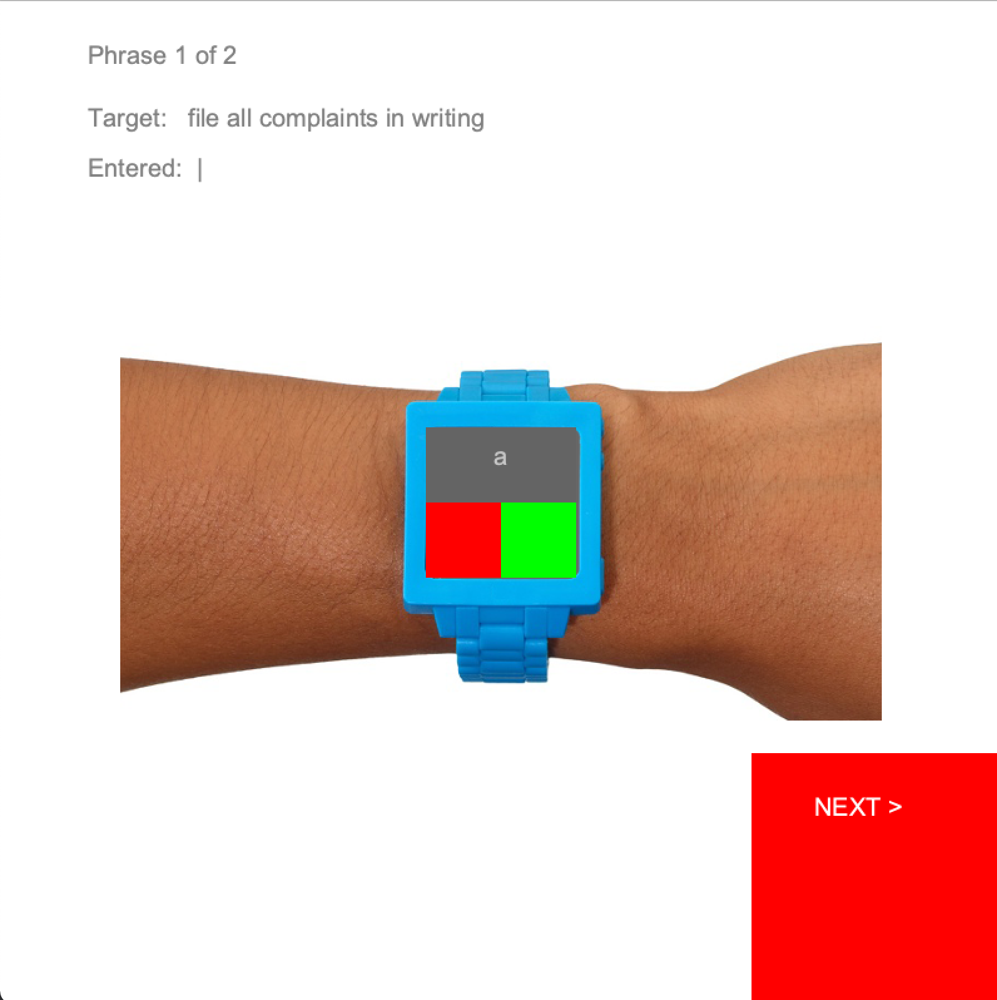

# 05391-bakeoff3

## Scaffold Code
[Can be found here](https://github.com/ikang9712/05391-bakeoff3/tree/main/TextEntryScaffold)
### Setup & Run on Android mode

### Scaffold Summary

  

#### Requirements
- Target phrase is given.
  - Target phrase only contains alphabets and space. No punctuation, no numbers. 
- User completes the target phrase

#### User Interaction
<ol>
  <li>A user chooses an alphabet by clicking red and green squares. </li>
  <ol>
    <li>Red square: call the previous alphabet. (If the current alphabet is 'b', after you click the square, it becomes 'a')</li>
    <li>Green square: call the next alphabet. (If the current alphabet is 'b', after you click the square, it becomes 'c')</li>
  </ol>
  <li>A user clicks on the gray square to enter the alphabet.</li>
  <li>After entering all alphabets, a user clicks the next button.</li>
  <ol>
    <li>Then, the next target phrase is given. </li>
  </ol>
</ol>

## Preliminary Ideas

## Prototype 1 Implementation

## Prototype 2 Implementation

## Prototype 3 Implementation (Final)
